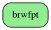
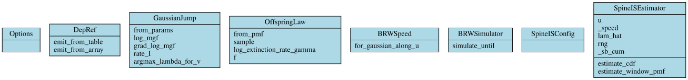
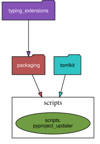

# Architecture Documentation

*Auto-generated on 2025-10-15*

## Project Overview

- **Python Files:** 7
- **Test Files:** 5
- **Frameworks:** None detected

## Architecture Diagrams

### High-Level Architecture

### Module Dependencies

### Class Structure

### Package Dependencies

## Key Components

Main directories:
- `docs/`
- `architecture/`
- `paper/`
- `src/`
- `brwfpt/`
- `tests/`
